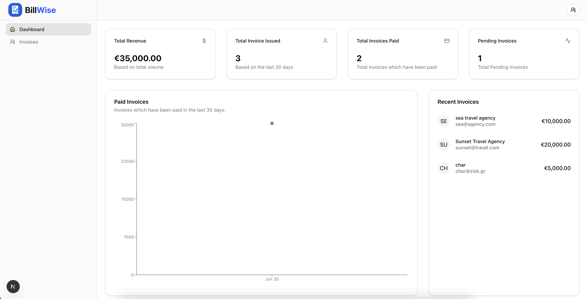

# BillWise - Invoicing Platform

BillWise is a modern invoicing SaaS platform that lets users create, send, and manage invoices with ease. It streamlines payment tracking, supports client management, and provides real-time insights into revenue and billing activity.

**[View deployed application here](https://invoice-app-pi-taupe.vercel.app/)**

---

## The Problem
For years, invoicing non-EU bookings at my hotel has been a pain. Spreadsheets everywhere, manually tweaked Word docs, folders full of PDFs, and a growing list of reminders to follow up. It was clunky, time-consuming, and easy to mess up.

So I finally thought:
👉 Why not build something that actually works for me??

So I did!

---

## Table of Contents
- [Installation](#installation)
- [Usage](#usage)
- [Features](#features)
- [Screenshots](#screenshots)
- [Technologies Used](#technologies-used)
- [Contact Information](#contact-information)
- [Resources](#resources)

## Installation

1. **Clone the repository:**
   ```bash
   git clone https://github.com/LazarosZiskos/invoice-app.git
   ```
2. **Navigate to the project directory:**
   ```bash
   cd invoice-app
   ```
3. **Install dependencies:**
   ```bash
   pnpm install
   ```

## Usage

**Run the development server:**
```bash
pnpm dev
```

## Features

👉 **Invoice Management** - Create, edit, delete invoices with dynamic fields.  
👉 **PDF Generation** - Download invoices as high-quality PDFs.  
👉 **Send Invoices by Email** - Automatically send invoices using Mailtrap.io.  
👉 **Reminder Emails** - Notify clients of overdue payments.  
👉 **Real-Time Analytics** - Graphs for revenue and invoice stats.  
👉 **Client Management** - Save client info and link it to invoices.  
👉 **Mark Paid/Unpaid** - Easily track payment status.  
👉 **Modern UI/UX** - Fast, responsive, mobile-friendly interface.

## Screenshots

**Hero Section**


## Technologies Used


- **Next.js** – React-based framework for fast web applications  
- **Tailwind CSS** – Utility-first CSS framework  
- **Prisma ORM** – Type-safe database access  
- **Neon Postgres** – Cloud-hosted PostgreSQL database  
- **Auth.js** – Secure authentication system  
- **Zod** – Schema-based validation  
- **Conform** – Accessible form validation and handling  
- **Mailtrap.io** – Email testing and delivery  

## Contact Information:

[](https://www.linkedin.com/in/lazaros-ziskos/)  
[](https://github.com/LazarosZiskos)

#### Made by Lazaros Ziskos

#### Email: **ziskoslaz@gmail.com**

#### Tel: **+30 6980228219**

## Resources:
- [Next.js](https://nextjs.org/docs)
- [Tailwind CSS](https://tailwindcss.com/docs)
- [Prisma](https://www.prisma.io/docs)
- [Neon](https://neon.tech/docs)
- [Auth.js](https://authjs.dev/)
- [Zod](https://zod.dev/)
- [Conform](https://conform.guide/)
- [Mailtrap](https://mailtrap.io/)

### Thank you for reading!
